<div align="center">
  <a href="https://lunarwerx.com"></a>
</div>

<div align="center">

[](https://lunarwerx.com)
[](https://discord.gg/PsWpeNUzhk)
[](https://github.com/LunarWerxs?tab=repositories&sort=stargazers)
<br>
[](https://lunarwerx.com)
[](https://lunarwerx.com/pricing.md)
[](https://lunarwerx.com/mcp)


</div>

**LunarWerx Studios is an independent software studio that builds AI-powered developer
tools and desktop utilities.** Everything below is shipped, most of it free for personal use and open source,
and most of it runs on your machine rather than ours. 🌙

## 🚀 Flagships

<table>
<tr>
<td width="50%" valign="top">
<a href="https://sagethumbs.lunarwerx.com/">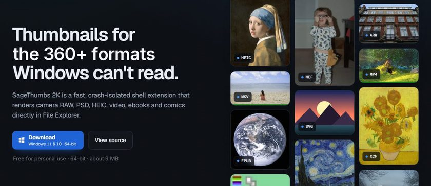</a><br>
<sub>DESKTOP UTILITY</sub><br>
<b>SageThumbs 2K</b><br>
Explorer thumbnails for 360+ file types Windows can't show, from a crash-isolated Rust shell extension.
</td>
<td width="50%" valign="top">
<a href="https://getconnections.icu/">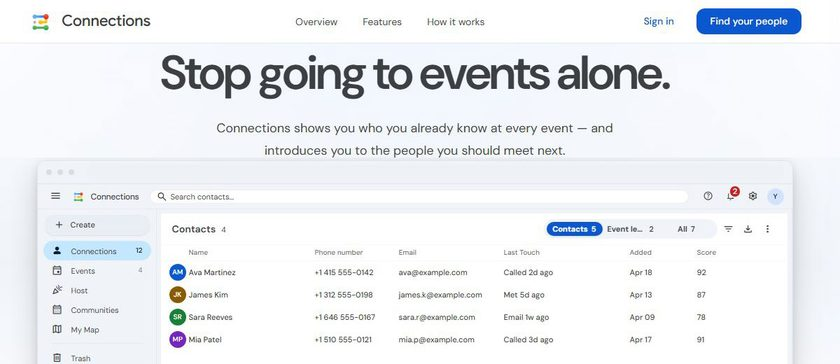</a><br>
<sub>WEB APP</sub><br>
<b>Connections</b><br>
A relationship workspace bringing contacts, shared calendars, follow-ups, events and warm introductions together in one place.
</td>
</tr>
<tr>
<td width="50%" valign="top">
<a href="https://agenthydra.lunarwerx.com/">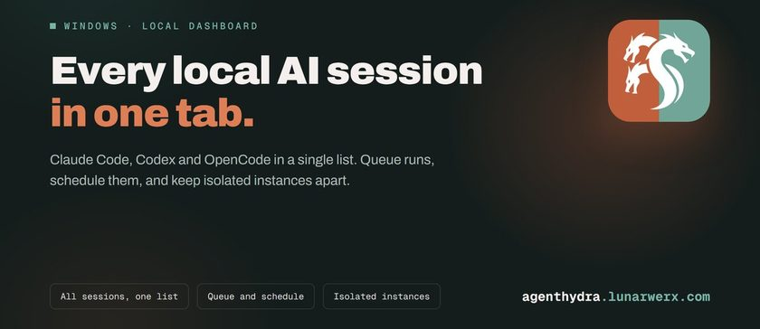</a><br>
<sub>AI AND AGENT TOOLING</sub><br>
<b>AgentHydra</b><br>
Every local AI coding session in one tab: Claude Code, Codex and OpenCode, with a queue you can schedule.
</td>
<td width="50%" valign="top">
<a href="https://normwind.lunarwerx.com/">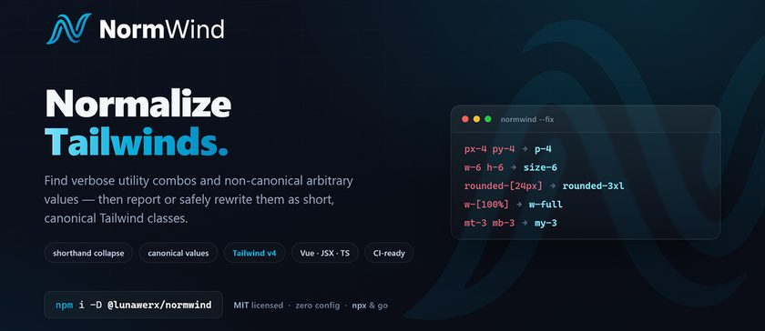</a><br>
<sub>DEVELOPER TOOL</sub><br>
<b>NormWind</b><br>
A zero-config CLI and GitHub Action that rewrites bloated Tailwind classes into canonical ones.
</td>
</tr>
</table>

<sub> website &nbsp;&nbsp; source &nbsp;&nbsp; marketplace</sub>

## 🤖 AI and agent tooling

<table>
<tr><th width="93"></th><th align="left">Product</th><th align="left">What it does</th><th width="68"></th></tr>
<tr>
<td width="93" height="90" align="center"><a href="https://github.com/LunarWerxs/AgentHydra">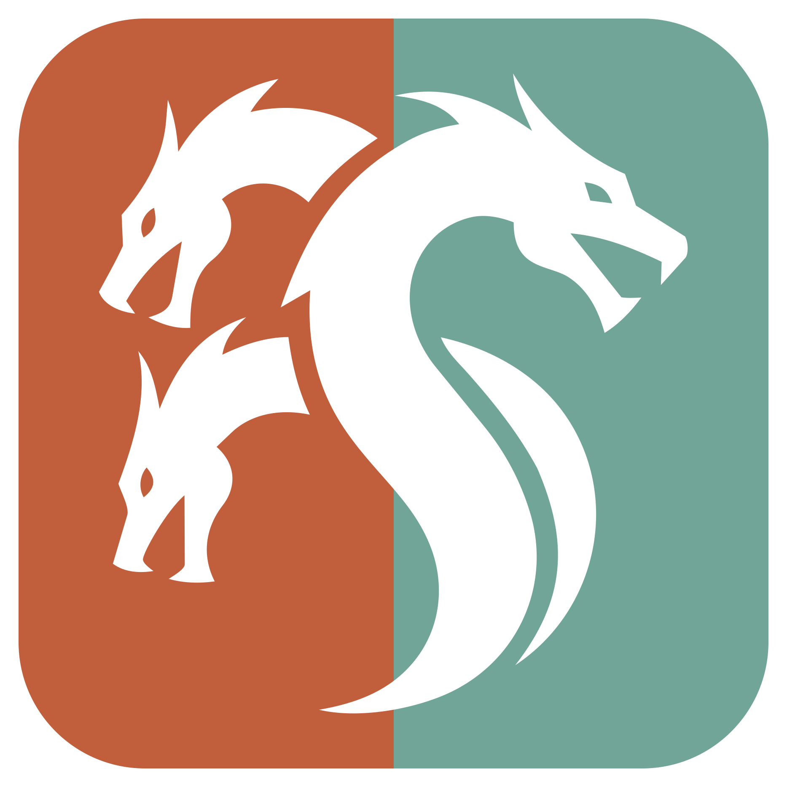</a></td>
<td><b>AgentHydra</b></td>
<td>Every local AI coding session in one tab, Claude Code, Codex and OpenCode, with a schedulable queue and isolated Claude Desktop instances.</td>
<td width="68"><a href="https://agenthydra.lunarwerx.com/" title="AgentHydra website"></a> <a href="https://github.com/LunarWerxs/AgentHydra" title="AgentHydra source"></a></td>
</tr>
<tr>
<td width="93" height="90" align="center"><a href="https://github.com/LunarWerxs/ReDesign">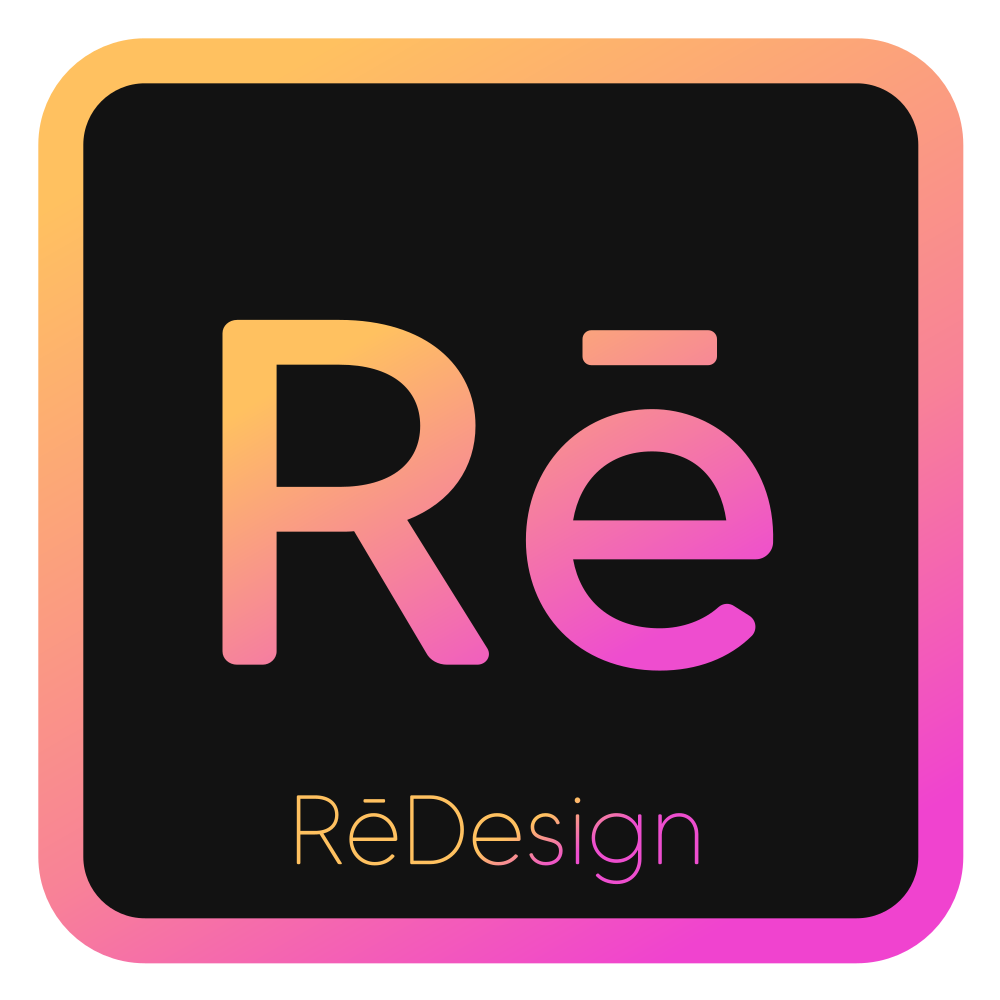</a></td>
<td><b>RēDesign</b></td>
<td>Drop in a UI screenshot and get a browsable wall of self-contained HTML redesigns from ten AI models at once.</td>
<td width="68"><a href="https://redesign.lunarwerx.com/" title="RēDesign website"></a> <a href="https://github.com/LunarWerxs/ReDesign" title="RēDesign source"></a></td>
</tr>
<tr>
<td width="93" height="90" align="center"><a href="https://github.com/LunarWerxs/DevWebUI">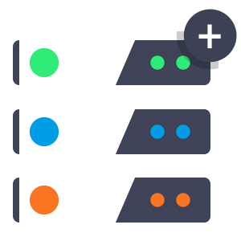</a></td>
<td><b>DevWebUI</b></td>
<td>A GUI <i>and</i> an MCP control plane for the dev servers already running on your machine. Humans click, agents automate the same daemon.</td>
<td width="68"><a href="https://devwebui.lunarwerx.com/" title="DevWebUI website"></a> <a href="https://github.com/LunarWerxs/DevWebUI" title="DevWebUI source"></a></td>
</tr>
<tr>
<td width="93" height="90" align="center"><a href="https://marketplace.visualstudio.com/items?itemName=LunarWerx.copilot-suite">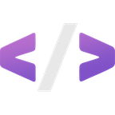</a></td>
<td><b>Copilot Suite</b></td>
<td>Save code as reusable snippets and inject them into Copilot Chat, with folders, sharing, toolsets and an MCP server bridging Claude Code and Codex.</td>
<td width="68"><a href="https://marketplace.visualstudio.com/items?itemName=LunarWerx.copilot-suite" title="Copilot Suite on the VS Code Marketplace"></a></td>
</tr>
<tr>
<td width="93" height="90" align="center"><a href="https://codex.lunarwerx.com/">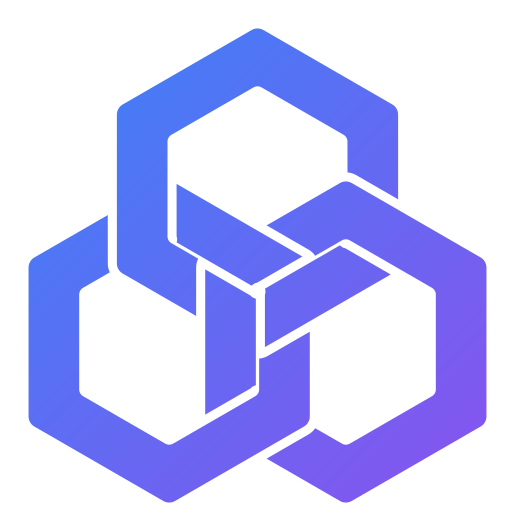</a></td>
<td><b>Codex Forecast</b></td>
<td>A statistical read on the next Codex usage-limit reset, rebuilt on every load from the public record and the OpenAI status feed. Free email alerts.</td>
<td width="68"><a href="https://codex.lunarwerx.com/" title="Codex Forecast website"></a></td>
</tr>
<tr>
<td width="93" height="90" align="center"><a href="https://models.lunarwerx.com/">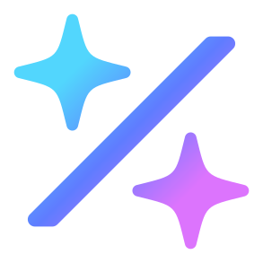</a></td>
<td><b>Model Odds</b></td>
<td>Every model family from twelve AI labs, ranked by the chance of a release within 30 days and given a likely date, from every past launch.</td>
<td width="68"><a href="https://models.lunarwerx.com/" title="Model Odds website"></a></td>
</tr>
</table>

## 🛠 Developer tools

<table>
<tr><th width="93"></th><th align="left">Product</th><th align="left">What it does</th><th width="68"></th></tr>
<tr>
<td width="93" height="90" align="center"><a href="https://github.com/LunarWerxs/RepoYeti"></a></td>
<td><b>RepoYeti</b></td>
<td>Run git from your phone, safely. A self-hosted daemon plus a mobile PWA, with no force-push and fast-forward-only pulls.</td>
<td width="68"><a href="https://repoyeti.com" title="RepoYeti website"></a> <a href="https://github.com/LunarWerxs/RepoYeti" title="RepoYeti source"></a></td>
</tr>
<tr>
<td width="93" height="90" align="center"><a href="https://github.com/LunarWerxs/NormWind"></a></td>
<td><b>NormWind</b></td>
<td>Normalize Tailwind. A zero-config CLI and GitHub Action: <code>px-4 py-4</code> → <code>p-4</code>, <code>w-6 h-6</code> → <code>size-6</code>.</td>
<td width="68"><a href="https://normwind.lunarwerx.com/" title="NormWind website"></a> <a href="https://github.com/LunarWerxs/NormWind" title="NormWind source"></a></td>
</tr>
<tr>
<td width="93" height="90" align="center"><a href="https://github.com/LunarWerxs/AnatomyOf"></a></td>
<td><b>AnatomyOf</b></td>
<td>An interactive, annotated tour of what is actually inside a source file, with colour-coded callouts, for 48 languages.</td>
<td width="68"><a href="https://anatomyof.lunarwerx.com/" title="AnatomyOf website"></a> <a href="https://github.com/LunarWerxs/AnatomyOf" title="AnatomyOf source"></a></td>
</tr>
<tr>
<td width="93" height="90" align="center"><a href="https://github.com/LunarWerxs/RoloDexter"></a></td>
<td><b>RoloDexter</b></td>
<td>A universal contact field mapper for Python and JavaScript. Messy CRM, CSV or email data into one clean canonical schema.</td>
<td width="68"><a href="https://rolodexter.lunarwerx.com/" title="RoloDexter website"></a> <a href="https://github.com/LunarWerxs/RoloDexter" title="RoloDexter source"></a></td>
</tr>
<tr>
<td width="93" height="90" align="center"><a href="https://github.com/LunarWerxs/CopilotTerminalMonitor">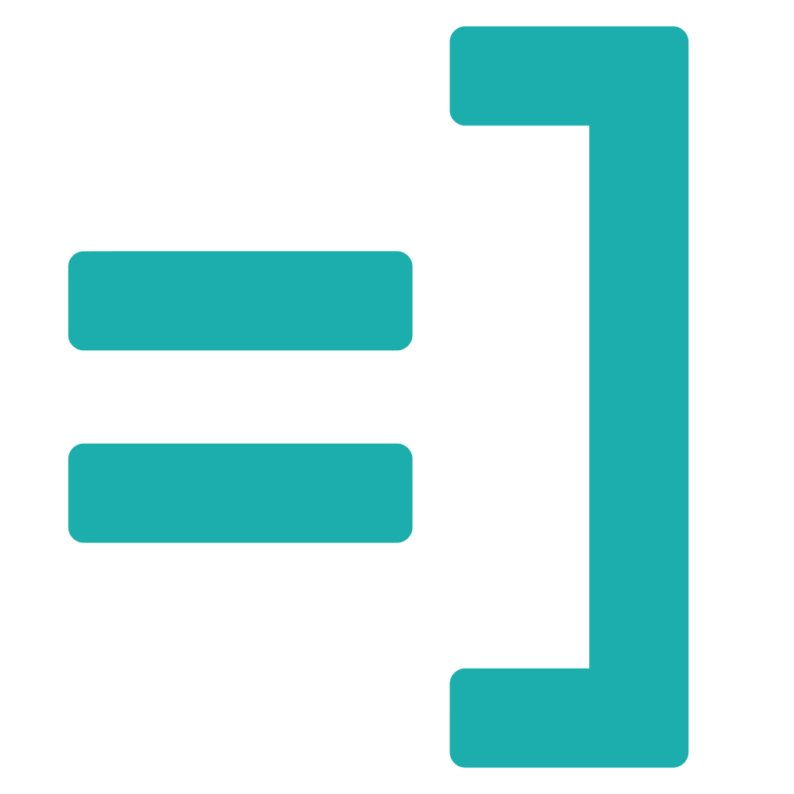</a></td>
<td><b>Copilot Terminal Monitor</b></td>
<td>Watches your VS Code terminal and alerts you when a command stalls or overruns, with auto-terminate, snooze and status-bar timers.</td>
<td width="68"><a href="https://marketplace.visualstudio.com/items?itemName=LunarWerx.copilot-terminal-monitor" title="VS Code Marketplace"></a> <a href="https://github.com/LunarWerxs/CopilotTerminalMonitor" title="Copilot Terminal Monitor source"></a></td>
</tr>
<tr>
<td width="93" height="90" align="center"><a href="https://github.com/LunarWerxs/FastColabCopy"></a></td>
<td><b>FastColabCopy</b></td>
<td>Transfers files inside Google Colab 10–50× faster by copying in parallel across threads instead of one file at a time.</td>
<td width="68"><a href="https://github.com/LunarWerxs/FastColabCopy" title="FastColabCopy source"></a></td>
</tr>
</table>

## 🖥 Desktop and everyday utilities

<table>
<tr><th width="93"></th><th align="left">Product</th><th align="left">What it does</th><th width="68"></th></tr>
<tr>
<td width="93" height="90" align="center"><a href="https://github.com/LunarWerxs/SageThumbs-2k"></a></td>
<td><b>SageThumbs 2K</b></td>
<td>A crash-isolated Rust shell extension giving Windows 11 Explorer thumbnails for 360+ file types it cannot show: camera RAW, PSD, HEIC/AVIF, video, ebooks, comics, CAD.</td>
<td width="68"><a href="https://sagethumbs.lunarwerx.com/" title="SageThumbs 2K website"></a> <a href="https://github.com/LunarWerxs/SageThumbs-2k" title="SageThumbs 2K source"></a></td>
</tr>
<tr>
<td width="93" height="90" align="center"><a href="https://github.com/LunarWerxs/QuickDictate"></a></td>
<td><b>QuickDictate</b></td>
<td>A tiny Windows tray app for voice dictation. Press a hotkey, talk, and your words type into whatever window has focus.</td>
<td width="68"><a href="https://quickdictate.lunarwerx.com/" title="QuickDictate website"></a> <a href="https://github.com/LunarWerxs/QuickDictate" title="QuickDictate source"></a></td>
</tr>
<tr>
<td width="93" height="90" align="center"><a href="https://github.com/LunarWerxs/VectorMojo"></a></td>
<td><b>VectorMojo</b></td>
<td>Converts design files to clean SVG entirely inside your browser: PSD, PSB, PDF, Illustrator AI, EPS, PNG, JPEG. No upload step.</td>
<td width="68"><a href="https://vectormojo.lunarwerx.com/" title="VectorMojo website"></a> <a href="https://github.com/LunarWerxs/VectorMojo" title="VectorMojo source"></a></td>
</tr>
<tr>
<td width="93" height="90" align="center"><a href="https://github.com/LunarWerxs/YTSort"></a></td>
<td><b>YTSort</b></td>
<td>Sorts any YouTube playlist you own by video length, shortest or longest first, in seconds. Userscript plus Chrome extension.</td>
<td width="68"><a href="https://ytsort.lunarwerx.com/" title="YTSort website"></a> <a href="https://github.com/LunarWerxs/YTSort" title="YTSort source"></a></td>
</tr>
<tr>
<td width="93" height="90" align="center"><a href="https://github.com/LunarWerxs/IMDBWatcharr"></a></td>
<td><b>IMDb Watcharr</b></td>
<td>Turns a public IMDb watchlist into a Radarr RSS feed and a Sonarr custom list, so your *arr stack picks up the same titles.</td>
<td width="68"><a href="https://watcharr.lunarwerx.com" title="IMDb Watcharr website"></a> <a href="https://github.com/LunarWerxs/IMDBWatcharr" title="IMDb Watcharr source"></a></td>
</tr>
</table>

## 🌐 Apps and platforms

<table>
<tr><th width="93"></th><th align="left">Product</th><th align="left">What it does</th><th width="68"></th></tr>
<tr>
<td width="93" height="90" align="center"><a href="https://getconnections.icu/"></a></td>
<td><b>Connections</b></td>
<td>A relationship workspace bringing contacts, shared calendars, follow-ups, events and warm introductions together in one place.</td>
<td width="68"><a href="https://getconnections.icu/" title="Connections website"></a></td>
</tr>
<tr>
<td width="93" height="90" align="center"><a href="https://www.accap.co/"></a></td>
<td><b>Accredited Capitalists</b></td>
<td>An invite-vetted network for high-net-worth and accredited investors, running onboarding, billing, a member community, events and deal flow.</td>
<td width="68"><a href="https://www.accap.co/" title="Accredited Capitalists website"></a></td>
</tr>
<tr>
<td width="93" height="90" align="center"><a href="https://sharingtime.us/"></a></td>
<td><b>SharingTime</b></td>
<td>A collaborative speaking timer that keeps talk-time balanced across a group, built for couples, families, and teams who want every voice heard.</td>
<td width="68"><a href="https://sharingtime.us/" title="SharingTime website"></a></td>
</tr>
<tr>
<td width="93" height="90" align="center"><a href="https://openbook.bio/"></a></td>
<td><b>OpenBook</b></td>
<td>A privacy-first bio-and-links page with self-destructing pages, password locks, view limits and burn-after-read links. No tracking, no scraping.</td>
<td width="68"><a href="https://openbook.bio/" title="OpenBook website"></a></td>
</tr>
</table>

## 💬 Community

<div align="center">

<a href="https://discord.gg/PsWpeNUzhk"></a>

Questions, bug reports, feature ideas, or just showing what you built with these.<br>
Every product has its own channel, and the people who wrote them are in there.

</div>

## 🔌 For AI agents

LunarWerx runs a free, public MCP server at **`https://lunarwerx.com/mcp`**. No account, no key.

```
claude mcp add --transport http lunarwerx https://lunarwerx.com/mcp
```

`tailwind_canonicalize` rewrites Tailwind classes into their canonical short form
(`p-[1rem]` → `p-4`, `rounded-[24px]` → `rounded-3xl`) from 12,438 replacements generated by
Tailwind's own design system. `lunarwerx_find_tool` searches this catalogue by task.
No MCP client? Same answers over plain HTTP at
[`/api/tailwind/canonical`](https://lunarwerx.com/api/tailwind/canonical?class=p-%5B1rem%5D),
and the whole table at [`/tailwind-canonical.json`](https://lunarwerx.com/tailwind-canonical.json).
Details: [lunarwerx.com/mcp.md](https://lunarwerx.com/mcp.md)

Listed in the [official MCP Registry](https://registry.modelcontextprotocol.io/v0/servers?search=lunarwerx)
as `com.lunarwerx/lunarwerx`, and from there on
[Smithery](https://smithery.ai/servers/lunarwerx/lunarwerx) and
[Glama](https://glama.ai/mcp/connectors/com.lunarwerx/lunarwerx).

## ❓ Questions people actually ask

<details>
<summary><b>What does LunarWerx software cost?</b></summary>

For personal use, the tools above are free to download and use. Most of them are
MIT-licensed open source, free for any use including commercial work, and YTSort is GPL-2.0.
Two of the apps are services rather than downloads: Connections has a free plan with paid Pass
upgrades, and Accredited Capitalists is an invite-only membership.

SageThumbs 2K, RepoYeti and QuickDictate are source-available under PolyForm Noncommercial.
They are free for personal and other noncommercial use; commercial use needs a licence per
installation:

- **SageThumbs 2K**: US$49 once (perpetual, with 12 months of updates) or US$2.99 a month,
  per Windows installation. [Terms](https://sagethumbs.lunarwerx.com/#pricing)
- **RepoYeti**: US$79 per installation, perpetual, with 12 months of updates.
  [Terms](https://repoyeti.com/#pricing)
- **QuickDictate**: US$19.99 once or US$1.99 a month, per installation.
  [Terms](https://github.com/LunarWerxs/QuickDictate#-license)

A few tools call a third-party AI or speech API, including RepoYeti's Smart Commit,
RēDesign and QuickDictate. Those are **bring-your-own-key**: you supply your own provider
credentials and pay that provider directly, which is often nothing on a free tier, and
QuickDictate also has a free offline Local provider. LunarWerx never takes a cut and never
resells API access.
</details>

<details>
<summary><b>Is it self-hosted or cloud?</b></summary>

Self-hosted and local-first by default. RepoYeti, AgentHydra, DevWebUI and RēDesign run as
a daemon on your own machine. SageThumbs 2K and QuickDictate are native Windows apps.
VectorMojo does its work entirely inside the browser tab, with no upload step at all.
Where an optional cloud feature exists, such as RepoYeti's remote tunnel, it is off until
you turn it on. The web apps (Connections, Accredited Capitalists, SharingTime, OpenBook) and
the two live tools (Codex Forecast, Model Odds) are hosted by us.
</details>

<details>
<summary><b>How do these tools work with AI agents?</b></summary>

Several are built for agents as first-class users, not just people. **Five of the products
above ship an MCP server of their own**, all of them local, free, and needing no account:

- **DevWebUI** and **AgentHydra** expose their whole daemon over MCP, so an agent drives
  exactly what a human clicks. AgentHydra also lets an agent ask which account it is
  running as and how much quota is left before it fans out work.
- **RepoYeti**'s `repoyeti mcp` exposes local repos plus guarded remote commit and sync,
  and publishes its full HTTP API at `GET /api/openapi.json`.
- **RēDesign**'s `bun run src/index.ts mcp` lets an agent queue and compare redesign runs.
- **SageThumbs 2K**'s `st2k --mcp` renders a thumbnail for a RAW, PSD, HEIC or video file
  Windows itself cannot read, and its `view` tool decodes any supported format to a PNG
  block so an agent can actually *see* the file.

**NormWind** ships as a GitHub Action so it can run unattended in CI. And the studio itself
runs the public MCP server above.

One more: **Connections Studio**, the developer side of Connections, exposes a
hosted MCP endpoint at `https://connections.icu/v1/mcp` that gives an assistant scoped reach
into accounts you have already connected (AWS, Cloudflare, GitHub, Stripe, Supabase and
more) instead of asking you to paste keys. Unlike everything above it is not anonymous: it
wants a Connections API key or an OAuth token, and the account is free.
</details>

<details>
<summary><b>Where do I ask something that isn't a bug?</b></summary>

The [Discord](https://discord.gg/PsWpeNUzhk). Every "New issue" page on these repos also
links there, so a question never has to wear a bug report's clothes. Real bugs are still
best as issues on the product's own repo, where they get tracked and closed.
</details>

<div align="center">

**[lunarwerx.com](https://lunarwerx.com)** is the full product directory.

<a href="https://lunarwerx.com"></a>

</div>
